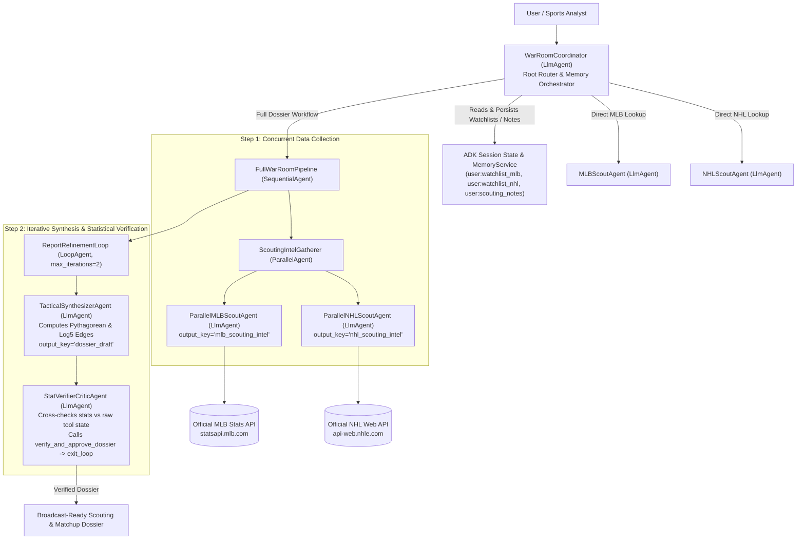

# ⚾🏒 PressBox War Room — Multi-Agent MLB & NHL Scouting & Matchup Analytics Agent

[](https://google.github.io/adk-docs/)
[](https://www.python.org/)
[](https://opentelemetry.io/)
[](./deployment/terraform/)

## 1. Problem & Solution Statement

### The Problem
Preparing pre-game scouting reports, head-to-head tactical matchup breakdowns, and win-probability projections across **Major League Baseball (MLB)** and the **National Hockey League (NHL)** is fragmented and time-consuming. Broadcasters, sports analysts, front-office scouts, and fantasy managers must manually cross-reference probable starting pitchers/goaltenders, handedness platoon splits (`vs LHP` / `vs RHP` OPS), special teams efficiency (`PP%` + `PK%` Net Special Teams Index), 5v5 expected goals share (`xGF%`), and Pythagorean/Log5 win probabilities across disparate data feeds—where a single misread stat can invalidate a tactical game plan.

### The Solution
**PressBox War Room** is an autonomous, multi-agent sports scouting and analytics system built on the **Google Agent Development Kit (`adk-python`)**. It pairs a root `WarRoomCoordinator` (`LlmAgent`) with concurrent `MLBScoutAgent` and `NHLScoutAgent` specialists (`ParallelAgent`), persistent analyst watchlists and session memory (`ToolContext.state` + `InMemoryMemoryService`), and an iterative **Synthesizer + Statistical Verifier Critic Loop** (`LoopAgent` with `exit_loop`) that audits every cited ERA, WHIP, OPS, PP%, PK%, GSAx, and Log5 win probability before publishing a verified **PressBox Matchup Dossier**.

> **Zero External Sports API Keys Required:** Both the **Official MLB Stats API** (`https://statsapi.mlb.com/api/v1`) and the **Official NHL Web API** (`https://api-web.nhle.com/v1`) are free and unauthenticated, backed by a deterministic local snapshot fallback so CI/CD tests and automated evaluations run 100% reliably offline or online.

---

## 2. Multi-Agent Architecture (`Orchestration & Logic`)



---

## 3. Alignment with the 5 Automated Evaluation Pillars

| Evaluation Pillar | Implementation Highlights | Key Source Files |
| :--- | :--- | :--- |
| **1. Tool & Interface Design** | **11 strictly-typed Pydantic v2 tools** (`with_strict_tool_schema` + `TOOL_JSON_SCHEMAS`) covering MLB probable starters & splits, NHL goalies & special teams (`PP%` + `PK%`), Bill James Pythagorean Expectancy ($\gamma=1.83$ MLB, $\gamma=2.05$ NHL) & Log5 head-to-head win probabilities, watchlist persistence, loop verification, and HITL approval gates. Zero silent fallbacks (`ToolErrorResponse` with `llm_recovery_instructions`). | [`schemas.py`](./pressbox_war_room/tools/schemas.py), [`mlb_tools.py`](./pressbox_war_room/tools/mlb_tools.py), [`nhl_tools.py`](./pressbox_war_room/tools/nhl_tools.py), [`analytics_tools.py`](./pressbox_war_room/tools/analytics_tools.py), [`hitl.py`](./pressbox_war_room/hitl.py) |
| **2. Context & Memory** | Persistent SQLite WAL database (`SQLiteScoutingMemoryDatabase`) + ADK `DatabaseSessionService`, sliding-window conversation history compaction (`EventsCompactionConfig` + `ConversationHistoryCompactor`), and non-blocking asynchronous background memory tasks (`AsyncBackgroundMemoryManager`). | [`memory.py`](./pressbox_war_room/memory.py), [`memory_tools.py`](./pressbox_war_room/tools/memory_tools.py), [`agent.py`](./pressbox_war_room/agent.py) |
| **3. Orchestration & Logic** | Combines all core ADK orchestration primitives (`LlmAgent`, `ParallelAgent`, `SequentialAgent`, `LoopAgent` with `exit_loop`), config-driven model routing, and **explicit Human-in-the-Loop (HITL) verification hooks (`enforce_hitl_verification_gate`, `tool_context.request_confirmation`, `request_human_approval_for_high_stakes_action`, `approve_or_reject_high_stakes_action`, `publish_official_war_room_dossier`)** pausing high-stakes operations until human sign-off. | [`hitl.py`](./pressbox_war_room/hitl.py), [`agent.py`](./pressbox_war_room/agent.py), [`dossier_pipeline.py`](./pressbox_war_room/sub_agents/dossier_pipeline.py), [`callbacks.py`](./pressbox_war_room/observability/callbacks.py) |
| **4. Observability & Tracing** | Pre-execution intent logging (`log_pre_execution_intent` before every agent/model/tool step), recursive PII & secret redaction (`PIIRedactor` scrubbing emails, phone numbers, SSNs, credit cards, API keys, JWTs, and IPs), OpenTelemetry spans, and `on_model_error_callback` / `on_tool_error_callback` resilience (`503 UNAVAILABLE` recovery). | [`callbacks.py`](./pressbox_war_room/observability/callbacks.py), [`scouting_eval.evalset.json`](./tests/eval/scouting_eval.evalset.json) |
| **5. Infrastructure & CI/CD** | Hardened multi-stage non-root `Dockerfile` with `HEALTHCHECK`, pinned `requirements.txt`, Cloud Build (`deployment/cloudbuild.yaml`), Vertex AI Agent Engine deployer (`deployment/agent_engine_deploy.py`), Terraform IaC (`deployment/terraform/`), and GitHub Actions CI/CD (`ci.yml` & `deploy.yml`). | [`Dockerfile`](./Dockerfile), [`cloudbuild.yaml`](./deployment/cloudbuild.yaml), [`agent_engine_deploy.py`](./deployment/agent_engine_deploy.py), [`main.tf`](./deployment/terraform/main.tf) |

---

## 4. Quickstart & Local Development

### Prerequisites
- Python 3.11+
- A Gemini API key (`GOOGLE_API_KEY`) from [Google AI Studio](https://aistudio.google.com/) **or** Google Cloud Vertex AI credentials.

### Installation
```bash
# 1. Clone the repository
git clone https://github.com/pielen/pressbox-war-room-agent.git
cd pressbox-war-room-agent

# 2. Install package with ADK and developer tools
pip install -e ".[dev,gcp]"

# 3. Configure environment variables
cp .env.example .env
# Edit .env and set GOOGLE_API_KEY="your-key"
```

### Running the Agent (ADK Web UI, CLI, or API Server)
```bash
# Launch the interactive Google ADK Web UI (http://localhost:8000)
adk web .

# Or interact with the War Room in your terminal
adk run pressbox_war_room

# Or launch the production FastAPI Server
adk api_server --host 0.0.0.0 --port 8080 .
```

### Example Prompts to Try
1. **MLB Matchup Scouting & Sabermetrics:**
   > *"Give me a complete MLB scouting matchup breakdown for the Los Angeles Dodgers (LAD) at the New York Yankees (NYY), including probable starting pitchers, LHP/RHP platoon splits, bullpen ERA, and the Pythagorean + Log5 win probability edge."*
2. **NHL Special Teams & Goaltending Duel:**
   > *"Compare the NHL special teams (PP% and PK% Net Index) and starting goalies (SV%, GAA, GSAx) for the Toronto Maple Leafs (TOR) at the Boston Bruins (BOS), and compute the home-ice Log5 win probability."*
3. **Cross-Sport Watchlist & Persistent Analyst Memory:**
   > *"Add the Edmonton Oilers (EDM) and Atlanta Braves (ATL) to my scouting watchlists with a note to track Connor McDavid's 5v5 xGF% and Chris Sale's slider usage, then generate a full War Room dossier."*

---

## 5. Testing & ADK Evaluation

```bash
# Run unit tests (MLB tools, NHL tools, Pythagorean/Log5 math, memory, orchestration & telemetry)
make test
# Or directly via pytest / unittest:
PYTHONPATH=. python3 -m unittest discover -s tests/unit -p "test_*.py" -v

# Run the Google ADK Evaluation suite against scouting_eval.evalset.json
make eval
```

---

## 6. Cloud Run & Terraform Deployment

```bash
# Build container image locally
make docker-build

# Provision Google Cloud Run v2 service, IAM roles, and Cloud Trace via Terraform
cd deployment/terraform
terraform init
terraform apply -var="project_id=your-gcp-project-id"
```
